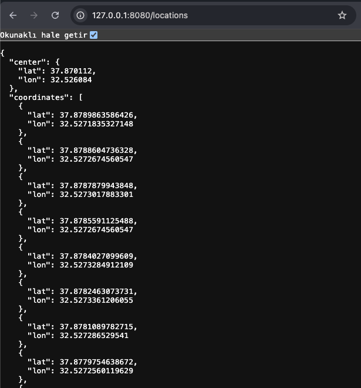
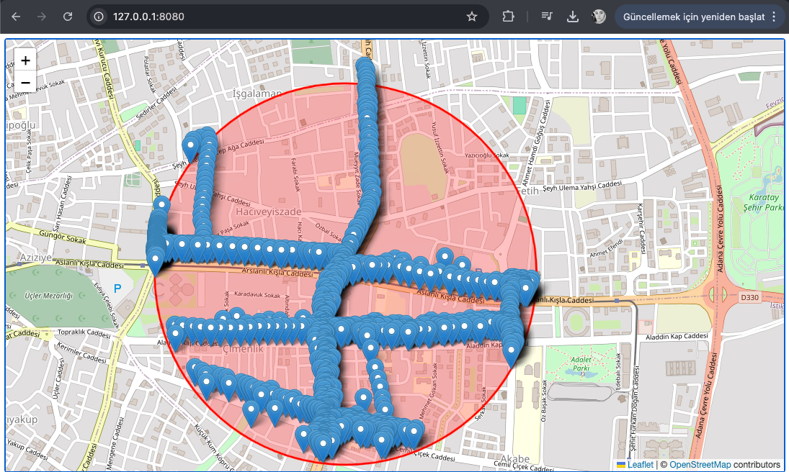

# 🚀 GeoSign

## 🚧 Getting Started

Follow these simple steps to get GeoSign up and running!

### Prerequisites

Ensure you have the following installed:

- **Rust 1.8+**
- **Docker 24.0+**

### Download and Run Qdrant

First, download the latest Qdrant image from Dockerhub:

```bash
docker pull qdrant/qdrant
```

Then, start the service:

```bash
docker run -p 6333:6333 -p 6334:6334 \
    -v $(pwd)/qdrant_storage:/qdrant/storage:z \
    qdrant/qdrant
```

### Installation

Clone the repository and build the project:

```bash
git clone https://github.com/fadimanakilci/geosign.git
cd geosign
```

### Running the GeoSign
Start the application with:

```bash
cargo run main 
```

### 🚀 You're all set!
<br><br>

### Viewing JSON Data

To view the JSON data, open your browser and go to:

http://127.0.0.1:8080/locations



This page displays the response data retrieved from Qdrant.
<br><br>

### Viewing Locations on a Leaflet Map

To view locations within a radius on a map, navigate to:

http://127.0.0.1:8080



This page shows the locations displayed as markers on a Leaflet map.
<br><br>

## 🤝 Contributing
We’d love your help in making Custom Message Broker even better! Here’s how you can contribute:

1. Fork the repository to your own GitHub account.
2. Create a branch for your feature: git checkout -b feature/AmazingFeature.
3. Commit your changes: git commit -m 'Add some AmazingFeature'.
4. Push to your branch: git push origin feature/AmazingFeature.
5. Open a Pull Request and let’s make this broker even more awesome together!
<br><br>

## 📄 License
This project is licensed under the MIT License – see the [LICENSE](./LICENSE) file for details.